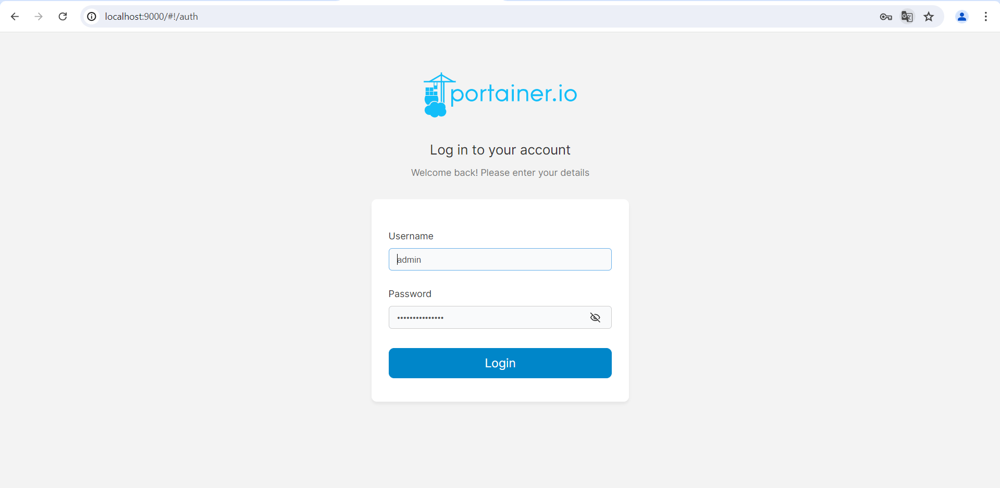

# Wordpress Seite über Docker
## WordPress-Website mit containisierten Umgebung mithilfe von Docker bereitstellen

## 1 Docker installieren
### Grundanforderung: Docker auf meinem Windows Rechner
### Installation überprüfen: 
```bash 
docker --version
```
## 2 WordPress Container erstellen/konfigurieren

### MariaDb-Image von Docker Hub heruntergeladen (für die DB von WordPress)
```bash 
docker pull mariadb 
```
### MariaDB Container starten
```bash 
docker run --name my-db -e MYSQL_ROOT_PASSWORD=db-password -d mariadb
```

## Das gleiche noch mit wordpress
### Wordpress-Image von Docker Hub heruntergeladen 
```bash
docker pull wordpress
```
### Wordpress Container gestartet und mit der zuvor erstellten MariaDB-Datenbank verbunden. Der Container läuft auf Port 8080
```bash
docker run --name my-wordpress -p 8080:80 --link my-db:mariadb -d wordpress
``` 

### DB für Wordpress aufsetzen
```sql
CREATE DATABASE wordpress DEFAULT CHARACTER SET uft8 COLLATE utf8_unicode_ci;
CREATE USER 'wp_user'@'localhost' IDENTIFIED BY 'tbz2024'
GRANT ALL ON wordpress.* TO 'wp_user'@'localhost';
```


### Einstellungen übers GUI 
### Dann habe ich mich bei der WordPress-Installation auf dem Localhost angemeldet 


## Docker Setup
### Neue Datei erstellen : docker-compose_mysql_wordpress.yaml
### Folgender Inhalt ist in der Datei:
```yaml
version: "3" 

services:
  
  db:
    image: mysql:debian
   
    restart: always
    environment:
      MYSQL_ROOT_PASSWORD: tbz2022
      MYSQL_DATABASE: WordPressDataBase
      MYSQL_USER: WordPressUser
      MYSQL_PASSWORD: tbz2022
    
  wordpress:
    depends_on:
      - db
    image: wordpress:latest
    restart: always
 
    ports:
      - "8000:80"
      
    environment:
      WORDPRESS_DB_HOST: db:3306
      WORDPRESS_DB_USER: WordPressUser
      WORDPRESS_DB_PASSWORD: tbz2022
      WORDPRESS_DB_NAME: WordPressDataBase

    volumes:
      ["./:/var/www/html"]
volumes:
  mysql: {}

  ```
#### Die Datei definiert zwei Dienste: Wordpress und MariaDB. Sie konfiguriert die Docker-Images, Ports und Umgebungsvariablen für die Verbindung und den Betrieb der beiden Dienste. 

  ### Docker compose Datei ausführen mit folgendem Befehl:

```bash
docker compose up -d
```


## PhpMyAdmin
### PhpMyAdmin auf dem Docker-Setup installiert, um die Verwaltung der MySQL-Datenbank zu erleichtern


### Anschliessend habe ich mich im Browser über den Localhost im PhpMyAdmin angemeldet


## Monitoring Portainer 

#### Für die Verwaltung meiner Docker-Container nutze ich Portainer, eine benutzerfreundliche Web-Oberfläche, die es ermöglicht, Docker-Ressourcen einfach zu überwachen und verwalten. 

### Zuerst habe ich ein Docker Volume für Portainer erstellt, damit die Daten von Portainer persistent gespeichert werden

```bash
docker volume create portainer_data
```

### Danach habe ich den Portainer Container mit den Bind-Mounts und den Netzwerk-Ports gestartet
```bash 
docker run -d -p 9000:9000 --name=portainer --restart=always -v /var/run/docker.sock:/var/run/docker.sock -v portainer_data:/data portainer/portainer-ce
```

### Anschliessend habe ich http://localhost:9000 im Browser geöffnet und die EInrichtung abgeschlossen

### Admin Konto erstellt und Local als Docker-Umgebung ausgewählt
### Danach mit dem admin eingeloggt

### Dann wurden mir alle laufenden Container angezeigt


### Portainer stellte sich als wertvolle Ergänzung des Projekts heraus, da es eine klare Übersicht über die Container bot und Verwaltungsaufgaben vereinfachte.

## Sicherheit im Container-Umfeld

### Aufgrund des statischen Charakters des Blogs ist eine lokale Kopie der Daten vorhanden, um die Webseite in einer neuen Umgebung wiederherstellen zu können.


## Fazit
### Dieses Projekt gab mir die Möglichkeit, Docker besser kennenzulernen, eine Technologie, die ich vorher kaum genutzt hatte. Durch die Nutzung von WordPress und MariaDB konnte ich sehen, wie Docker bei der Verwaltung von Anwendungen hilft und die Skalierbarkeit und Effizienz verbessert.

### Eine der größten Herausforderungen war das Überwachen der Docker-Container. Viele Tools waren schwer einzurichten, und die Anleitungen waren oft unklar oder unvollständig. Besonders PRTG war kompliziert und instabil, was frustrierend war. Auch Checkmk entsprach nicht meinen Erwartungen.

### Trotz dieser Schwierigkeiten habe ich festgestellt, dass Docker eine gute Lösung für Tests und die Bereitstellung von Anwendungen ist. Es bietet eine flexible und leistungsfähige Plattform für viele Aufgaben in der Entwicklung und im Betrieb.

